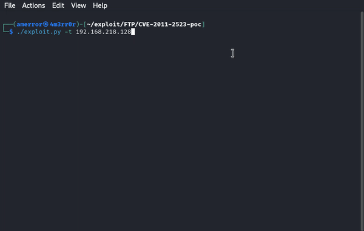

# CVE-2011-2523-poc

This is a python3 script to exploit the CVE-2011-2523, the VSFTPD 2.3.4 Backdoor Command Execution, using socket and telnetlib modules





# Requirements
```
sudo python3 -m pip install pwntools
```
# Install
```
git clone https://github.com/4m3rr0r/CVE-2011-2523-poc.git
cd CVE-2011-2523-poc/
chmod +x exploit.py
```
# Usage


```
./exploit.py -t IP -p Port
```